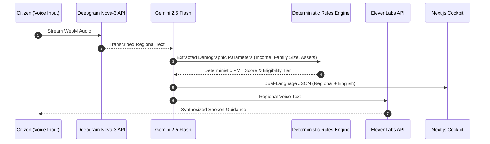

# BISP Benefits Navigator

> Multilingual, voice-first civic assistant for social support program eligibility with deterministic Proxy Means Test (PMT) calculation.

[](LICENSE)
[](https://nextjs.org/)
[](https://cloud.google.com/run)
[](https://deepmind.google/technologies/gemini/)

---

## Overview

In Pakistan, millions of citizens qualify for social assistance under the Benazir Income Support Programme (BISP) but encounter friction with text-heavy online portals and multi-page forms.

**BISP Benefits Navigator** is a voice-first pre-screening engine. Users speak naturally in regional languages (Urdu, Pashto, Punjabi, Sindhi, Balochi), and the system extracts key demographic parameters, runs a deterministic backend scoring engine, and returns spoken guidance.

---

## Architecture Flow



---

## Core Capabilities

- **Voice-Driven Interaction**: Low-friction audio interface that accepts native spoken queries without text form input.
- **Dialect Handling**: Transcribes regional language audio via Deepgram Nova-3 without losing colloquial context.
- **Deterministic Scoring Engine**: Disables generative calculation for financial eligibility. Gemini is restricted to structured parameter extraction, while a deterministic Node.js engine (`bisp-rules-engine.ts`) calculates official PMT scores.
- **Quota Failover**: Catches API rate-limit errors and rotates through configured fallback credentials.
- **Dual-Language Output**: Produces spoken audio in the citizen's native language while generating structured English transcripts in the UI for administrative review.
- **Rate-Limiting**: IP-based request throttling (10 requests/minute) to mitigate abusive traffic.

---

## Repository Structure

```
.
├── bisp-voice-navigator/
│   ├── app/                  # Next.js App Router endpoints and views
│   ├── components/           # UI components and audio recorder widgets
│   ├── lib/
│   │   ├── bisp-rules-engine.ts  # Deterministic PMT calculation logic
│   │   ├── gemini.ts             # Gemini 2.5 Flash client
│   │   └── audio.ts              # STT / TTS pipeline wrappers
│   ├── public/               # Static assets and cached welcome audio
│   ├── Dockerfile            # Container definition for Cloud Run
│   └── package.json          # Node dependencies
└── README.md
```

---

## Getting Started

### Prerequisites
- Node.js 18 or higher
- API credentials for Google Gemini, Deepgram, and ElevenLabs

### Local Setup

1. **Clone the repository**:
   ```bash
   git clone https://github.com/HamzaKhanBUIC/BISP-Benefits-Navigator.git
   cd BISP-Benefits-Navigator/bisp-voice-navigator
   ```

2. **Install dependencies**:
   ```bash
   npm install
   ```

3. **Configure environment variables**:
   Create a `.env.local` file:
   ```env
   GEMINI_API_KEY=your_gemini_api_key
   DEEPGRAM_API_KEY=your_deepgram_api_key
   ELEVENLABS_API_KEY=your_elevenlabs_api_key
   ```

4. **Run development server**:
   ```bash
   npm run dev
   ```
   Access the cockpit at `http://localhost:3000`.

---

## Deployment to Google Cloud Run

```bash
# Build container image
gcloud builds submit --tag gcr.io/YOUR_PROJECT_ID/bisp-benefits-navigator

# Deploy to Cloud Run
gcloud run deploy bisp-benefits-navigator \
  --image gcr.io/YOUR_PROJECT_ID/bisp-benefits-navigator \
  --platform managed \
  --region us-central1 \
  --allow-unauthenticated \
  --set-env-vars GEMINI_API_KEY=your_key,DEEPGRAM_API_KEY=your_key,ELEVENLABS_API_KEY=your_key
```

---

## AI Safety & Governance

1. **No Generative Math**: All financial thresholds and PMT scores are calculated strictly by the deterministic rules engine.
2. **Explicit Verification Notice**: Spoken responses clearly state that the system provides pre-screening estimates and that final authorization requires physical verification at a registered BISP or NADRA center.
3. **Transient Data**: Audio buffers are processed in-memory and are not persisted to long-term storage.

---

## License

This project is licensed under the MIT License. See [LICENSE](LICENSE) for details.
